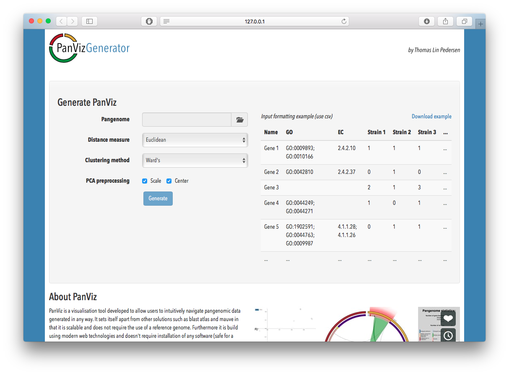

# <a name='intro'></a>Introduction
Pangenomes are data structures used in comparative microbial genomics. In 
essence it is a grouping of genes across different genomes where each group 
should consist of orthologue genes (i.e. sequence similarity is in itself not 
enough). One of the standard representation of pangenomes is as a pangenome 
matrix, which is a presence/absence matrix with rows defining gene groups and 
columns defining genomes. This seemingly simple representation hides the fact 
that investigating pangenomes and try to understand the biological implications
of the grouping can be a daunting task. 
[PanViz](https://github.com/thomasp85/PanViz) is an interactive visualization
tool, build using html and Javascript (relying heavily on 
[D3.js](http://d3js.org)), that empowers the user to investigate, query and 
understand their pangenomes in a fluid, beautiful and easy manner. 
PanViz visualizations are fully self-contained html files that can be shared
with coworkers and viewed offline if needed. PanVizGenerator is the intended 
tool for creating PanViz visualizations from scratch using your own data. It 
provides both an easy and informative GUI (based on `r BiocStyle::CRANpkg("shiny")`), as
well as a standard R interface. The GUI supports csv formatted pangenome
matrices, while the programmatic interface in addition supports standard R 
matrix and data.frame representation as well as the class system provided by
`r BiocStyle::Biocpkg("FindMyFriends")`.

# Data requirements
PanViz relies on two different types of data for its visualization approach. The
first is the pangenome matrix as described in the [introduction](#intro) while
the second is a functional annotation of the gene groups in the pangenome based 
on [gene ontology](http://geneontology.org) terms. In addition human readable
gene group names as well as E.C. numbers will augment the quality of the end
result.

How this data is supplied depends on the user. The standard Bioconductor 
approach to creating and working with pangenomes is the class system defined by
`r BiocStyle::Biocpkg("FindMyFriends")`. FindMyFriends provides functionality for adding
annotation to both the gene groups and genomes contained in a pangenome and if
these facilities are used a PanViz can be created directly from that. If you
wish to opt out of the FindMyFriends approach, or if the pangenome has been 
provided for you, PanVizGenerator can also accept standard matrix data, along
with vector or list style annotation.

There is a third data source that is independent of the individual data sets but
required by PanViz none-the-less: The full gene ontology graph is embedded 
within each PanViz file, allowing for visual navigation of the GO ontology as it
applies to your data. PanVizGenerator automatically fetches the gene ontology
when required and caches it for later use, so this is not something you, as a 
user, should worry about. In order to force a fresh download of the gene 
ontology for some reason, the `getGO()` function is provided.

```{r, eval=TRUE, echo=TRUE, results='hide', message=FALSE}
library(PanVizGenerator)
getGO()
```


# Creating PanViz visualizations
PanVizGenerator both supports a shiny-based GUI as well as the standard R based
approach. The GUI does not offer the same flexibility but is intended for people
less experience using R. Apart from the PanViz creation functionality it also 
contains an example video of a pangenome as well as a rundown of the features
and thoughts in PanViz.

## Using the shiny GUI
The GUI is started by using the eponymous `PanVizGenerator()` function, which 
opens the GUI in the default browser:

```{r, eval=FALSE}
PanVizGenerator()
```

Running the above will present you with a view much like what is shown in the 
figure below.



The GUI is quite self-explanatory as it present limited functinality. The user 
can select a csv file containing their pangenome data, make some standard 
choices regarding the algorithms used for some of the data transformations, and 
then press the generate button. Once the data processing step has run its course
a download button will appear for the user to click.

If the user is unsure about the formatting of the csv file an example file is 
available for download as reference. Apart from this the GUI is also a 
presentation of PanViz' functionality, so even trained R users can benefit from
opening the GUI at least once and read through it.

## Using the R interface
The most flexible approach to generating PanViz visualizations is to use the 
`panviz` method. In order to mimick the functionality of the GUI pass in a 
string with the location of a csv file.

```{r, echo=TRUE, eval=TRUE, warning=FALSE}
csvFile <- system.file('extdata', 'exampleData.csv', 
                       package = 'PanVizGenerator')
outputDir <- tempdir()

# Generate the visualization
panviz(csvFile, location = outputDir)
```

A more flexible approach is to have your pangenome data in R and pass it in 
directly:

```{r, echo=TRUE, eval=TRUE, warning=FALSE}
# Get data from csv
pangenome <- read.csv(csvFile, quote='', stringsAsFactors = FALSE)
name <- pangenome$name
go <- pangenome$go
ec <- pangenome$ec
pangenome <- pangenome[, !names(pangenome) %in% c('name', 'go', 'ec')]

# Annotation can come in many ways
# This is valid
head(go)
# And this is valid too
head(strsplit(go, '; '))
# Or another delimiter
head(gsub('; ', 'delimiter', go))

# Generate the visualization
panviz(pangenome, name=name, go=go, ec=ec, location=outputDir)
```

If you're already working with your data in FindMyFriends it is even easier. 
Just make sure that you use the correct columns in groupInfo to store the 
annotation and PanVizGenerator takes care of the rest:

```{r, echo=TRUE, eval=TRUE, warning=FALSE, message=FALSE}
# Get an example pangenome with annotation
library(FindMyFriends)
pangenome <- .loadPgExample(withNeighborhoodSplit = TRUE)
annotation <- readAnnot(system.file('extdata', 
                                    'examplePG', 
                                    'example.annot', 
                                    package = 'FindMyFriends'))
head(annotation)
pangenome <- addGroupInfo(pangenome, annotation, key = 'name')
pangenome

# Generate the visualization
panviz(pangenome, location = outputDir)
```

## Some other bells and whistles
The above show just the standard behavior which should match the need for most 
users. It is possible though to tailor the functionality a bit using some 
addition parameters:

### Don't merge everything into one file
```{r, echo=TRUE, eval=TRUE, warning=FALSE}
panviz(pangenome, location = outputDir, consolidate = FALSE)
```

This tells PanVizGenerator to not merge data and JavaScript code into the 
PanViz.html file but instead keep it as separate files. This might be of
interest for debugging or just poking around in the inards of PanViz. For 
regular use it is nice to have a single self-contained file though.

### Open the result in a browser
```{r, echo=TRUE, eval=FALSE, warning=FALSE}
panviz(pangenome, location = outputDir, showcase = TRUE)
```

If you wish to inspect the result right away, you can ask PanVizGenerator to
open the html file in your default browser using `browseURL()`. Setting 
`location = tempdir()` and `showcase = TRUE` let you experiment with different
settings without getting a lot of PanViz.html files lying around (kind of like 
using standard R plotting).

### Modify data transformation
```{r, echo=TRUE, eval=TRUE, warning=FALSE}
panviz(pangenome, location = outputDir, dist = 'binary', clust = 'complete',
       center = FALSE, scale = FALSE)
```

To modify the look of the scatterplot and dendrogram used for navigating the
genomes in the pangenome you can change the distance measure, clustering 
algorithm and whether data should be centered and scaled, using the parameters
shown above. In general the defaults are set to produce a nice plot, but needs
may vary.

# Example video
Being an interactive web-based visualization, the result of all of the above can
be difficult to showcase. Because of this a small video has been prepared - 
depending on where you read this vignette it might not show up though.

<iframe src="https://player.vimeo.com/video/113594599?color=ffffff&title=0&byline=0&portrait=0" width="700" height="424" frameborder="0" webkitallowfullscreen mozallowfullscreen allowfullscreen></iframe>

In case nothing shows, see the video at its [Vimeo](https://vimeo.com/113594599) 
page

# Session info
```{r, echo=FALSE, eval=TRUE}
sessionInfo()
```

